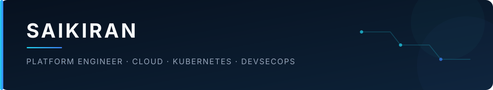

  

I’m a platform engineer focused on building secure, reliable cloud infrastructure and developer platforms. I enjoy turning complex systems into clear, automated experiences that help teams deliver software with confidence.

## Focus

**Cloud & Kubernetes** 
Designing resilient cloud-native platforms, container orchestration, networking, identity, and service-to-service communication.

**Infrastructure automation** 
Building reusable infrastructure as code and operational automation with Terraform, Ansible, Python, Bash, and Go.

**CI/CD & developer platforms** 
Creating governed delivery pipelines, reusable workflows, and self-service paths that reduce developer friction.

**Security & observability** 
Embedding policy, secrets management, supply-chain security, metrics, logs, and traces into the platform lifecycle.

## Toolkit

`AWS` · `Azure` · `Google Cloud` · `Kubernetes` · `Docker` · `Helm` · `Istio` 
`Terraform` · `Ansible` · `GitHub Actions` · `GitLab CI` · `Jenkins` 
`Python` · `Go` · `Bash` · `Prometheus` · `Grafana` · `OpenTelemetry` · `Vault`

## Current interests

- Platform engineering and internal developer platforms
- Secure multi-cloud architecture
- Kubernetes reliability and workload identity
- Policy as code and software supply-chain security
- Infrastructure for AI and retrieval-augmented applications

## Certifications

---

  Build reliable systems. Automate deliberately. Keep the developer experience simple.

